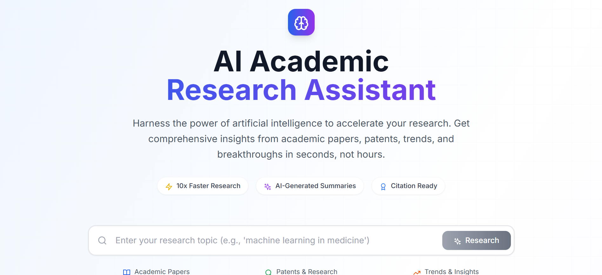

# AI Academic Research Assistant

Harness the power of artificial intelligence to accelerate your academic research.
The **AI Academic Research Assistant** provides comprehensive insights from academic papers, patents, trends, and breakthroughs — in seconds, not hours.

---

## Screenshot



---

## Table of Contents
- [Introduction](#introduction)
- [Features](#features)
- [Tech Stack](#tech-stack)
- [Installation](#installation)
- [Configuration](#configuration)
- [Usage](#usage)
- [Examples](#examples)
- [Troubleshooting](#troubleshooting)
- [Contributors](#contributors)
- [License](#license)

---

## Introduction
The AI Academic Research Assistant is designed to make research **10× faster** by leveraging advanced AI models.
From **AI-generated summaries** to **trend forecasting**, it delivers everything a researcher needs to quickly understand a topic and stay ahead of developments.

Whether you’re a student, academic, or industry professional, this tool simplifies the discovery process with:
- **Citation-ready references**
- **Intelligent search across academic and patent databases**
- **Real-time insights on emerging trends**

---

## Features
- **AI-Powered Analysis** — Uses cutting-edge AI to synthesize and summarize large volumes of research.
- **Academic Paper Search** — Access millions of peer-reviewed papers from Google Scholar with relevance ranking.
- **Patent Discovery** — Search global patent databases to explore innovations and IP landscapes.
- **Trend Analysis** — Get real-time trending data and predictive insights into emerging research topics.
- **Fast, Citation-Ready Results** — Summarized content is ready for academic referencing.

---

## Tech Stack
- **Frontend:** React + TypeScript + Vite
- **Styling:** Tailwind CSS
- **APIs:**
  - [Google Gemini API](https://ai.google.dev/gemini-api)
  - [SerpAPI](https://serpapi.com/) for Google Scholar and patent search
- **Build Tools:** PostCSS, ESLint, Vite

---

## Installation

### Prerequisites
- Node.js (v18+ recommended)
- npm or yarn
- API keys for:
  - **Gemini API**
  - **SerpAPI**

### Steps
```bash
# Clone the repository
git clone https://github.com/ADAMFUTUR/ai-research-assistant.git
cd ai-research-assistant

# Install dependencies
npm install

# Start development server
npm run dev
```

## Configuration
Create a `.env` file in the project root and add your API keys:

```env
VITE_GEMINI_API_KEY=your_gemini_api_key_here
VITE_SERPAPI_KEY=your_serpapi_key_here
```

## Usage
1. Enter your research topic (e.g., `machine learning in medicine`) in the search bar.
2. Select whether to search academic papers, patents, or trends.
3. Review AI-generated summaries and citations.
4. Explore related trends and predictive insights.

## Examples
**Example Search:**
> `machine learning in oncology` → **Returns:**
>
> - Top 10 relevant peer-reviewed papers
> - Key AI-generated summary points
> - Recent patents in the field
> - Trend chart predicting research growth

## Troubleshooting
- **No results returned?** Ensure your API keys are valid and your `.env` file is correctly configured.
- **API errors?** Check your API usage limits for your Gemini and SerpAPI accounts.
- **Styling not loading?** Run `npm install` again to ensure all dependencies, including Tailwind CSS, are installed correctly.

## Contributors
- **Adam IMLOUL** — Creator & Maintainer

## License
This project is licensed under the MIT License — feel free to use, modify, and distribute.
